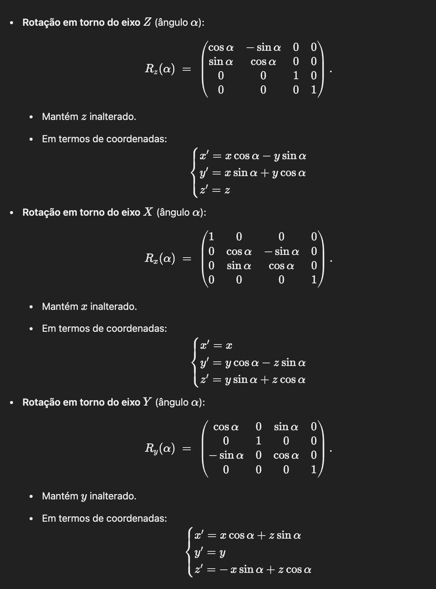

# Transformações Geométricas 3D 

Em Computação Gráfica 3D, cada ponto no espaço é tipicamente representado por coordenadas (x,y,z). 
Para facilitar as operações de transformação (translação, rotação, escalamento, etc.), introduzimos o conceito de coordenadas homogéneas, passando a representar cada ponto com quatro coordenadas:

Assim, uma transformação geométrica (translação, rotação ou escalamento) pode ser expressa sob a forma de multiplicação de matrizes 4×4.

## 1. Translação

### 1.1. Definição
Uma translação por (Tx,Ty,Tz) significa que cada vértice ou ponto é deslocado dessas quantidades em cada eixo: 

### 1.2. Matriz de Translação em 3D
Em coordenadas homogéneas, a matriz de translação é:

Ao multiplicar (𝑥 𝑦 𝑧 1)^𝑇 por esta matriz, obtemos o ponto transladado 
(
𝑥
+
𝑇
𝑥
𝑦
+
𝑇
𝑦
𝑧
+
𝑇
𝑧
1
) ^
𝑇

## 2. Escalamento
### 2.1. Definição
Um escalamento por fatores 
(
𝑆
𝑥
,
𝑆
𝑦
,
𝑆
𝑧
) faz com que:

### 2.2 Matriz de Escalamento em 3D
A matriz correspondente é:

### 2.3 Escalamento em Torno de um Ponto Arbitrário

Por omissão, o escalamento acima ocorre em torno da origem (0,0,0). Para escalar em torno de um ponto 
(
𝑥
𝐹
,
𝑦
𝐹
,
𝑧
𝐹
), fazemos:
 - Transladar o ponto 
(
𝑥
𝐹
,
𝑦
𝐹
,
𝑧
𝐹
) para a origem, ou seja, aplicar 
T
(
−
𝑥
𝐹
,
−
𝑦
𝐹
,
−
𝑧
𝐹
)
.
 - Aplicar a matriz de escalamento 
S
(
𝑆
𝑥
,
𝑆
𝑦
,
𝑆
𝑧
).
- Repor o objeto na posição original, aplicando a translação inversa 
T
(
𝑥
𝐹
,
𝑦
𝐹
,
𝑧
𝐹
).

Em notação de composições de matrizes, 𝑀 escala em torno de :

## 3. Rotação

### 3.1 Eixos de Rotação em 3D

Ao contrário do 2D, onde a rotação é sempre em torno de um ponto (eixo perpendicular ao plano), em 3D podemos ter:

1. Rotação em torno de um dos eixos coordenados 
(
𝑥
,
𝑦
,
𝑧
)

2. Rotação em torno de um eixo arbitrário no espaço.

### 3.2. Matrizes de Rotação em Torno dos Eixos Coordenados

### 3.3. Rotação em Torno de um Eixo Arbitrário

Se quisermos rodar em torno de um eixo que não seja um dos principais (
𝑥
,
𝑦
,
𝑧
), precisamos de:

1. **Transladar** o objeto de modo a que o eixo de rotação passe pela origem.
2. **Alinhar** esse eixo com um dos eixos principais (por exemplo, eixo 
𝑍
), através de rotações auxiliares.
3. **Aplicar a rotação** desejada em torno do eixo escolhido.
4. **Desfazer a rotação auxiliar** (oposto do passo 2).
5. **Desfazer a translação** (oposto do passo 1).
