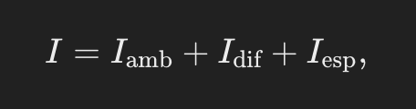
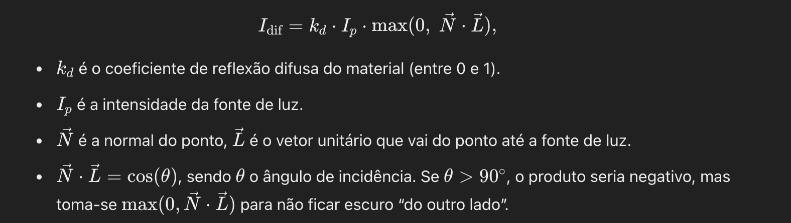
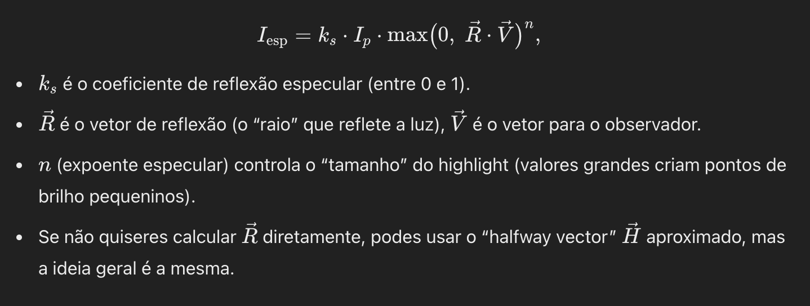

# Modelos de Iluminação Locais

## 1. Modelos de Iluminação Locais
Em computação é comum querer que cada face apresente uma cor coerente com a luz que incide sobre ela.
O **modelo de iluminação local** calcula a cor de um ponto de superfície assumindo **apenas** a influência das luzes na cena(e as propriedades desse material), sem considerar reflexos ou sombras de outros objetos.

Em particular, modelamos como se cada ponto de uma face recebesse luz diretamente das fontes de luz e a refletisse de acordo com a “rugosidade” e “componente especular” do material. Esse modelo (também chamado `modelo de Phong` na sua forma básica) resulta em:

1.`Iamb(componente ambiente)`: 
Representa a luz difusa geral, que chega após inúmeras reflexões no ambiente. É constante na cena toda.

onde 𝑘𝑎 é o coeficiente de reflexão ambiente do objeto (entre 0 e 1), e 𝐼𝑎 é a intensidade ambiente global na cena (às vezes designada Iglobal).

2.`Idif(componente difusa ou lambertiana)`:
Representa a luz que incide diretamente da fonte e espalha‐se em todas as direções de forma uniforme (uma face “opaca”, rugosa). A **lei de Lambert** diz que a intensidade difusa depende do ângulo entre a normal do objeto e o vetor da luz:

3.`Iesp (componente especular ou reflexo brilhante)`:
Corresponde aos brilhos (“highlights”) em materiais polidos, que dependem da posição do observador. No **modelo de Phong**, escreve‐se:

Assim, a intensidade final num ponto é:

Podemos repetir isso por componente de cor (R, G, B), pois cada luz e material tem cores diferentes.

## 2. Atenuação pela Distância
Muitas vezes, se a luz está longe, a intensidade recebida diminui com a distância. Então, acrescenta-se um fator de atenuação `Fatt` que pode ser:

onde 
𝑑 é a distância entre a fonte de luz e o ponto, e (𝑐1𝑐2,𝑐3) são constantes ajustáveis. Assim, a parte difusa e especular do termo (𝐼𝑝) fica multiplicada por 𝑓att.

## 3. Reflexão Ambiente + Difusa + Especular
Juntando tudo, se houver l fontes de luz, cada uma contribuindo com difusa e especular, e uma componente ambiente global, podemos ter: 

Cada fonte 
ℓ tem intensidade 𝐼𝑝,ℓ e fator de atenuação 𝑓att,ℓ. Se 𝑁⋅𝐿ℓ for negativo (a luz está por trás), tomamos zero.

## 4. Interpretação na Implementação
- Quando vês CGFappearance (no WebCGF ou OpenGL) e defines setAmbient(r,g,b,1), setDiffuse(r,g,b,1), setSpecular(r,g,b,1) e setShininess(n), estás, na prática, a definir os coeficientes (𝑘𝑎,𝑘𝑑,𝑘𝑠) e o expoente 𝑛 para cada cor (R,G,B).
- A luz também tem setDiffuse(...), setSpecular(...), e setAmbient(...), definindo 𝐼𝑝 para as várias componentes.
- A normal do objeto (declarada em initBuffers()) é que diz como 𝑁 está orientada.

